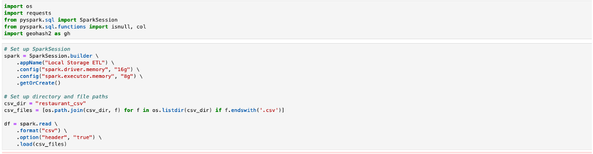
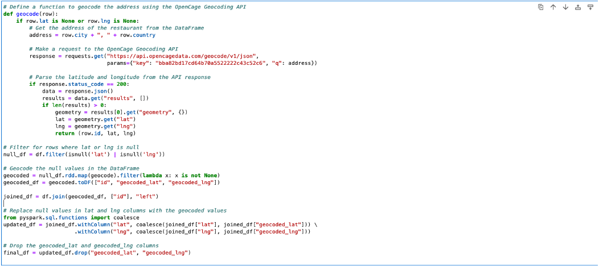
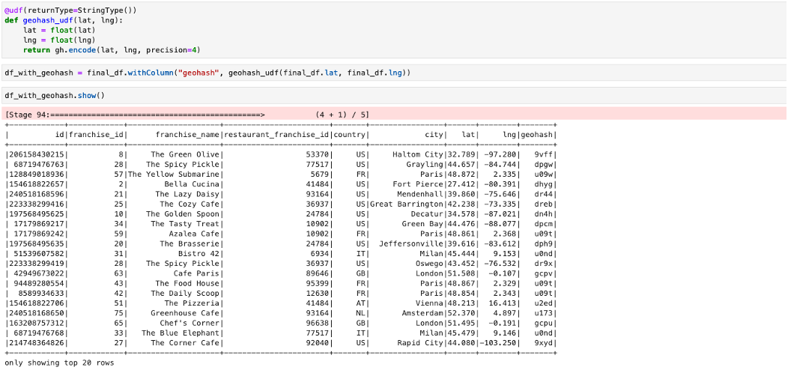
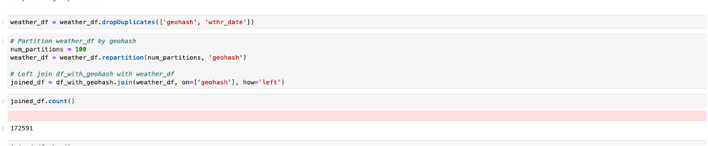
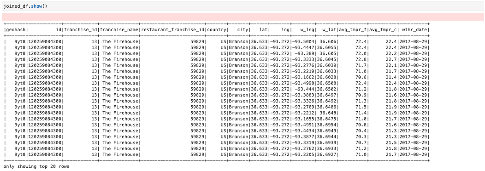
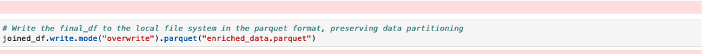

### Create a Spark ETL job to read data from a local storage. You can find the data in the Spark Practice—Dataset file on the page with the task description.

### Check restaurant data for incorrect (null) values (latitude and longitude). For incorrect values, map latitude and longitude from the OpenCage Geocoding API in a job via the REST API.

### Generate a geohash by latitude and longitude using a geohash library like geohash-java. Your geohash should be four characters long and placed in an extra column.

### Left-join weather and restaurant data using the four-character geohash. Make sure to avoid data multiplication and keep your job idempotent.

###	Store the enriched data (i.e., the joined data with all the fields from both datasets) in the local file system, preserving data partitioning in the parquet format.

